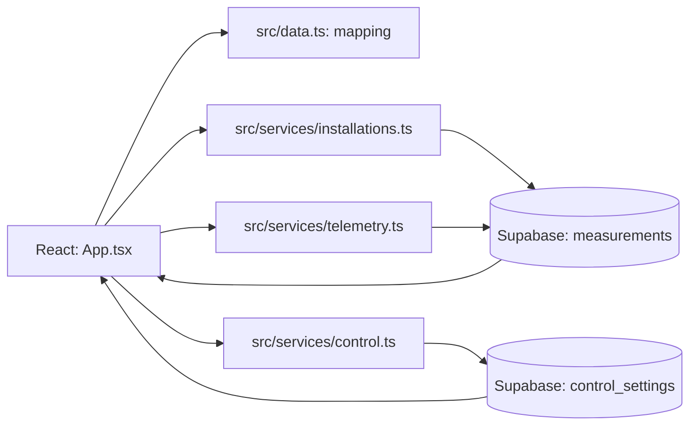

# Documentation technique

## Vue d’ensemble

Application client React 18, TypeScript et Vite. L’interface est en français et utilise Recharts pour les visualisations et `@supabase/supabase-js` pour l’authentification, l’accès Postgres et Realtime.

## Structure des sources

| Chemin | Responsabilité |
| --- | --- |
| `src/App.tsx` | Navigation, état React, tableaux de bord, formulaires, graphique et interactions. |
| `src/data.ts` | Modèle de lecture, conversion depuis le type SQL, événements d’alarme, métriques de maintenance, signaux locaux et formatage des dates. |
| `src/lib/supabase.ts` | Création du client Supabase navigateur à partir des variables publiques. |
| `src/lib/database.types.ts` | Types TypeScript des tables `measurements` et `control_settings`. |
| `src/services/installations.ts` | Lecture triée des mesures, abonnement Realtime aux deux tables. |
| `src/services/telemetry.ts` | Insertion des relevés de mesure. |
| `src/services/control.ts` | Authentification, lecture et écriture de la consigne cible. |
| `supabase/schema.sql` | Tables, index, grants et politiques RLS déclarés par le projet. |
| `docs/graphique.md`, `docs/visualisations.md` | Détails des axes, calculs et conventions d’affichage. |

## Configuration et commandes

Variables navigateur attendues dans `.env.local` :

| Variable | Usage |
| --- | --- |
| `VITE_SUPABASE_URL` | URL du projet Supabase. |
| `VITE_SUPABASE_ANON_KEY` | Clé publique utilisée par le client navigateur; la RLS reste la frontière d’autorisation. |

Les fichiers `.local` sont ignorés par Git. Ne jamais exposer `SUPABASE_SERVICE_ROLE_KEY` ni une clé secrète via un préfixe `VITE_`.

- `npm run dev` : serveur Vite local.
- `npm run lint` : validation TypeScript (`tsc --noEmit`).
- `npm run build` : validation TypeScript et build de production.
- `npm run preview` : prévisualisation du build.

## Modèle de données

### `public.measurements`

Une ligne représente un relevé historisé. `id` est généré automatiquement; `timestamp` vaut `now()` par défaut. Les températures et consignes sont des `numeric(5,2)` en °C. `heating_state` et `fan_state` sont des booléens nullable. `heating_power`, `pid_output`, `operating_mode`, `alarm_code` et `cycle_number` sont enregistrés tels quels; aucune unité ou sémantique supplémentaire ne doit être supposée sans documentation de l’équipement.

### `public.control_settings`

Table de consigne courante à ligne unique, contrainte par `id = 1`. `setpoint` est `numeric(5,2)`; `updated_at` et `updated_by` indiquent la date de modification et l’utilisateur connecté.

### Distinction métier

`measurements.setpoint` est la consigne associée à un relevé historique. `control_settings.setpoint` est la valeur cible courante. L’application enregistre cette dernière mais ne l’applique pas au PLC/chauffage; il faut un consommateur backend/automate séparé.

## Flux de lecture et de rafraîchissement

1. `getMeasurements` demande jusqu’à 1 000 lignes, classées par horodatage décroissant, puis les renvoie dans l’ordre chronologique.
2. `mapMeasurement` convertit les noms SQL vers le modèle `Reading` utilisé par l’interface.
3. La lecture est lancée au montage et selon la fréquence choisie. Le choix et l’intervalle personnalisé sont conservés dans `localStorage`.
4. Si Realtime est activé, un abonnement aux changements sur `measurements` et `control_settings` déclenche aussi un rafraîchissement.
5. La lecture de la consigne est tentée avec celle des mesures. Une erreur de lecture de consigne est actuellement absorbée et affichée comme absence de valeur cible.

Le polling et Realtime sont indépendants : activer Realtime ne désactive pas la fréquence périodique.

## Écriture et validation

- L’écriture d’une mesure passe par `insertMeasurements`; le code UI exige au moins un champ non nul, valide les valeurs numériques et les bornes du type SQL.
- La consigne accepte 0 à 999,99 °C et au plus deux décimales. L’arrondi est contrôlé sans comparaison naïve des produits flottants.
- `writeControlSetpoint` vérifie la session Supabase avec `auth.getUser()`, puis écrit `id = 1`, la consigne, l’horodatage et l’identifiant du compte via `upsert`.
- Les erreurs de mutation sont remontées à l’interface et présentées dans le formulaire correspondant.

## Indicateurs de maintenance et signaux

`getMaintenanceMetrics` dans `src/data.ts` calcule des estimations sans modifier le schéma :

- Temps de marche : somme des intervalles entre états chauffage vrais consécutifs; les écarts supérieurs à deux fois la médiane des intervalles observés sont exclus. L’estimation ne connaît pas l’instant exact des transitions.
- Temps d’atteinte de consigne : pour le dernier cycle renseigné, premier échantillon atteignant `temperature >= setpoint - 1 °C`, mesuré depuis le premier échantillon exploitable du cycle.
- Stabilisation : trois échantillons consécutifs dans une bande de ±1 °C de la consigne.
- Le nombre de cycles et d’alarmes affiché est limité à la période sélectionnée; le calcul de cycle utilise les mesures chargées pour conserver le début du dernier cycle quand il précède la période du graphique.

`getProcessSignals` signale les codes d’alarme reçus et les dépassements supérieurs à 1 °C. Le panneau et le rapport les qualifient de règles indicatives; ils ne remplacent ni des seuils de sécurité machine ni une analyse d’ingénieur.

## Authentification, rôle et RLS

Le client utilise `signInWithPassword`, maintient la session via le client Supabase et écoute `onAuthStateChange`. Le projet n’implémente pas actuellement de rôle applicatif `admin` : le nom « Administrateur » affiché dans le profil est un libellé statique. Les politiques SQL actuelles autorisent `authenticated` à lire et insérer dans `measurements` et à insérer/mettre à jour `control_settings`; elles ne vérifient pas `app_metadata.role`. La lecture de `control_settings` est aussi autorisée à `anon`. Une métadonnée `admin` seule ne modifierait donc pas les permissions actuelles.

`supabase/schema.sql` active la RLS sur `control_settings`, autorise la lecture publique, et lie `updated_by` à `auth.uid()` pour les écritures authentifiées. Les politiques de `measurements` autorisent la lecture et l’insertion aux utilisateurs authentifiés. Le script doit être exécuté dans le projet correspondant à `VITE_SUPABASE_URL`; éditer le fichier local ne change pas la base distante.

Ne jamais ajouter une clé de service dans le client. Si un rôle admin devient une exigence, mettre en place les claims/metadata via une API Admin côté serveur et modifier les politiques RLS pour vérifier ce claim.

## Limites connues

- Le backend/PLC ne consomme pas encore la consigne cible.
- Les unités de `heating_power` et l’échelle de `pid_output` ne sont pas définies.
- L’historique est limité à 1 000 lignes côté client; l’export actuel imprime la page et ne produit pas de CSV.
- Le bouton « Analyser avec IA » affiche actuellement un rapport local fondé sur des règles; aucun fournisseur IA ni backend d’inférence n’est raccordé.
- Les cartes de maintenance autres que les formulaires ne correspondent pas à des tables dédiées.
- La lecture Realtime dépend de l’activation de la publication sur les tables dans Supabase.

## Validation après modification

- Modifications TypeScript : `npm run lint`.
- Modifications pouvant affecter le build : `npm run build`.
- Modifications de schéma/politiques : appliquer le SQL sur un environnement de test et valider lecture, écriture authentifiée et refus de l’accès non autorisé.